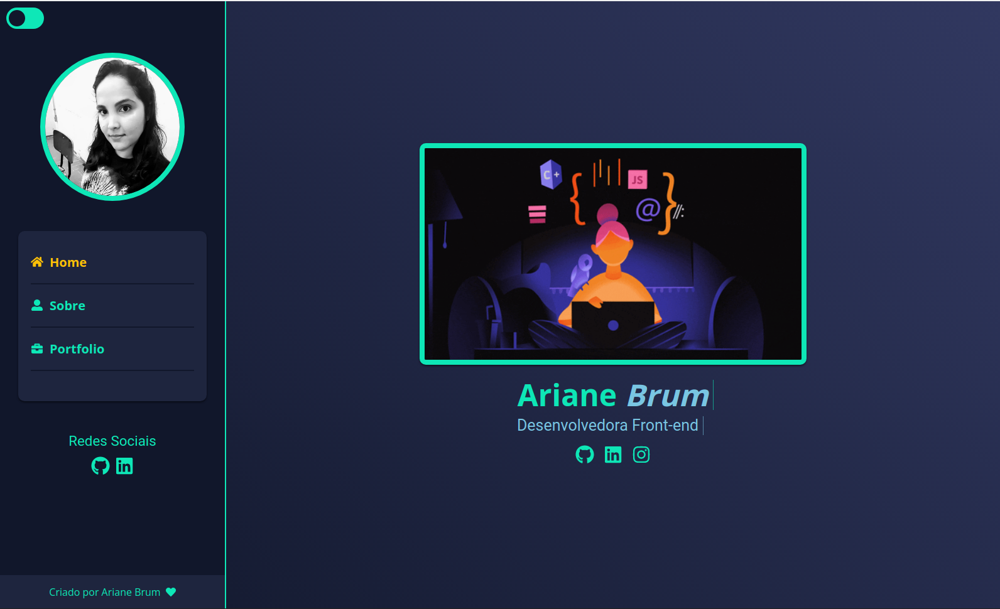

 
 

<h2 id="objetivo">:dart:  Objetivo</h2>

🚀 Portfólio pessoal criado com o objetivo de apresentar um pouco sobre mim e meus conhecimentos. Além de  mostrar meus projetos ao decorrer de minha carreira.

  <h2 id="preview">:movie_camera: Demo Gif</h2>

  

  <h2 >:computer: Desktop</h2>
    <h4>:new_moon_with_face: Tema Dark</h4>
  
    
    <h4>:sun_with_face:Tema Light</h4>
  
  

    

  <h2>:iphone:  Mobile</h2>
  <h4 >:new_moon_with_face: Tema Dark</h4>
  
    
   <h4 >:sun_with_face:Tema Light</h4>
  
    
<a  href="https://portfolio-pessoal-ariane-brum.vercel.app/" > Clique para visitar o projeto
</a>
  

<h2 id="funcionalidades">✅ Funcionalidades</h2>

- [x] **Tema escuro e claro.**

- [x] **O tema é mantido**

- [x] **Animações nas páginas**

- [x] **Layout responsivo**

<h3>:books: Seções</h3>

O site é composto por 3 seções diferentes:

- Home: Uma breve apresentação com meu nome e minhas redes sociais.
- Sobre: Essa página tem o objetivo de apresentar um pouco sobre mim e meus conhecimentos.
- Portfólio: Exibe alguns projetos desenvolvidos, no qual, ao clicar no respectivo projeto, abre um modal com mais informações sobre o mesmo e seu link com o código no GitHub.

<h3 id="tecnologias">🛠 Tecnologias utilizadas</h3>

Esse projeto foi desenvolvido com as seguintes tecnologias:

- React.js  
- Next.js  
- CSS Modules  
- React-Icons  
- Prismic CMS  
- Sass  
- React-slick  
- Nextjs-progressbar 
- React Hooks  
- Context API   

Desenvolvido com :hearts: por Ariane Brum.
